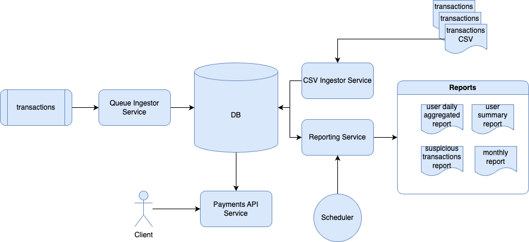
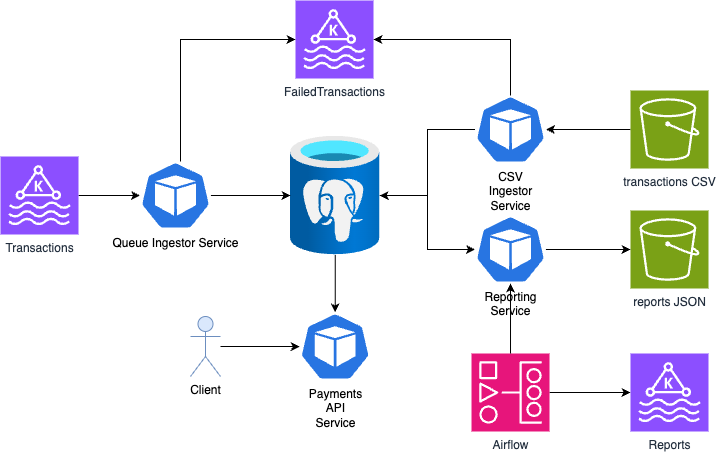

# Architecture

## High level design



## Low level design


# Components

## User API
### Payments API Service

Purpose: 

- Get user reports
- List users
- List currencies

## Reporting and analytics
### Reporting Service

Purpose:

- Generate reports in JSON format
- Generate reports in the DB Reporting layer

## Airflow

Purpose:

- Trigger Reporting service job to produce monthly user report
- Trigger CSV ingestor Service on demand

## Ingestion services

These services share functionality that includes:

- Validate input message against the schema
- Apply business rules validation
- Mark suspicious transactions
- Drop duplicates within a window
- Write records one by one into the Transactions table

### Queue Ingestor Service

Purpose:
- Read records from the Transactions topic


### CSV Ingestor Service

Purpose:
- Read records from the provided CSV file

Note: it is also possible to use COPY ... FROM ... postgres feature, but it will block the Queue Ingestion Service in case of a huge CSV file insert.

## Kafka topics

### Transactions

Purpose:
- intermediate layer for keeping transactions until they reached the DB

Note: transactions are created somewhere on the Banking application layer. I omit its implementation. This topic seeds with the transactions from CSV files.

Message format:
```json
{
    "transaction_id": "tx123",
    "sender_id": "user1",
    "receiver_id": "user2",
    "amount": 250.00,
    "currency": "USD",
    "timestamp": "2025-05-01T12:00:00Z",
    "status": "completed"
}
```

### FailedTransactions

Purpose:
- keep all the incorrect transaction messages

Message format:
```json
{
    "reason": "ERROR",
    "source": "kafka:transactions",
    "data": {
        "transaction_id": "tx123",
        "sender_id": "user1",
        "receiver_id": "user2",
        "amount": 250.00,
        "currency": "USD",
        "timestamp": "2025-05-01T12:00:00Z",
        "status": "completed"
    }
}
```

### Reports

Purpose:
- notifications to the downstream services regarding the report completeness.

Note: in case of a cloud object storage we could use native Events, but I want to have more control on this process.

Message format:
```json
{
    "timestamp": "2025-05-01T12:00:00Z",
    "path": "/year=2025/month=05/day=13/<report_type>/path/to/report/report.json",
    "bucket": "reports",
}
